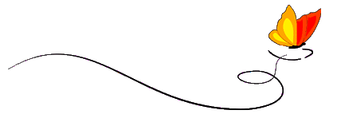

# Hey, I'm Mugunthan 

### Mobile, Desktop & Android TV Developer from Tamil Nadu, India

Passionate about app development using **Compose Multiplatform** to build seamless **Android**, **iOS**, **Desktop**, and **Android TV** applications.

---

<h3 align="center">Tech Stack</h3>

  
  
  
  
  
  
  
  
  
  
  
  

---

<h3 align="center">GitHub Stats</h3>

  
  

  

  

---

<h3 align="center">Contribution Graph</h3>

  

  

---

*Always building something new.*

