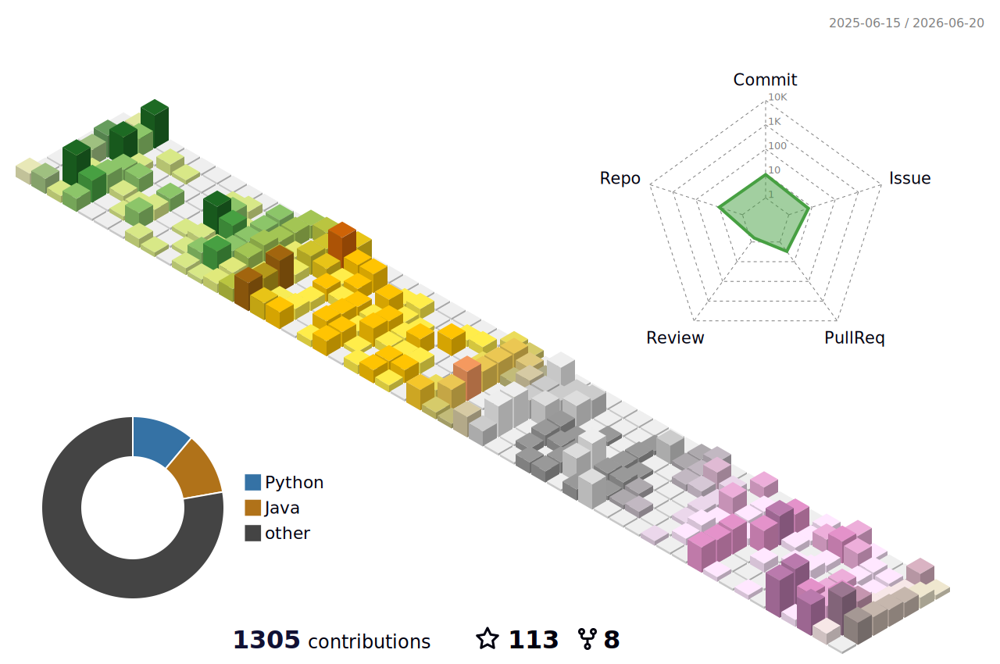

# Hey, I'm Mugunthan 

### Mobile & Desktop App Developer from Tamil Nadu, India

Passionate about mobile and desktop app development, utilizing **Jetpack Compose** to create seamless **Android**, **iOS**, and **Desktop** applications.

---

### Tech Stack

---

### GitHub Stats

  
  

  

  

---

### Contribution Graph

---

*Always building something new.*

