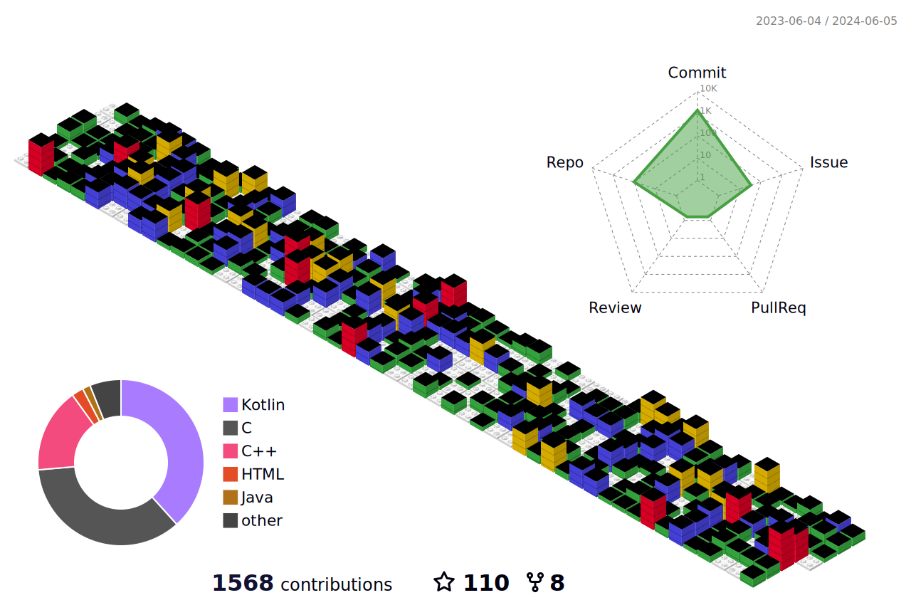
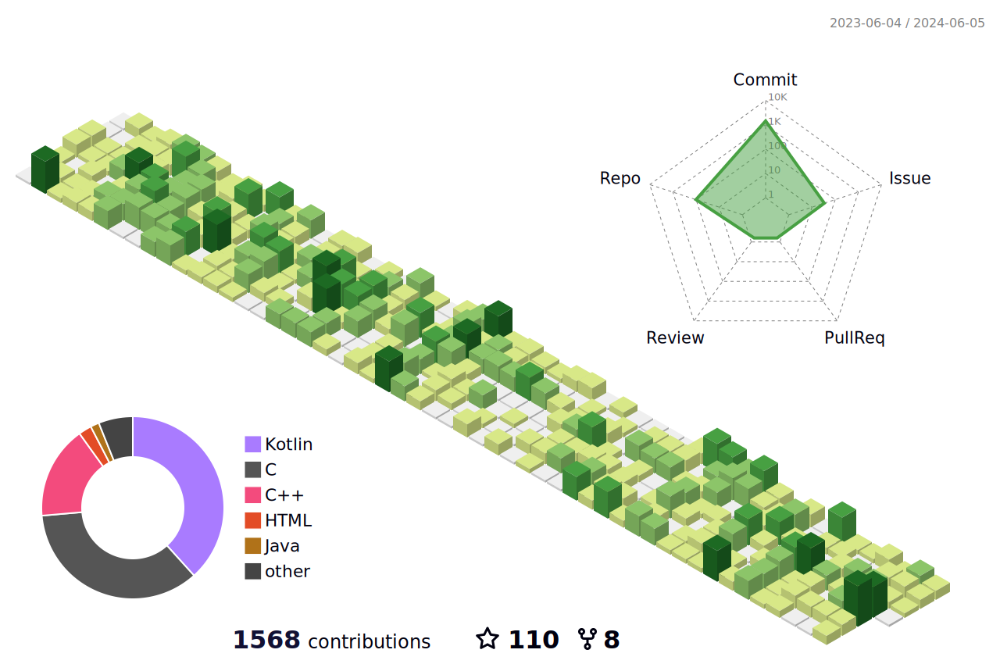
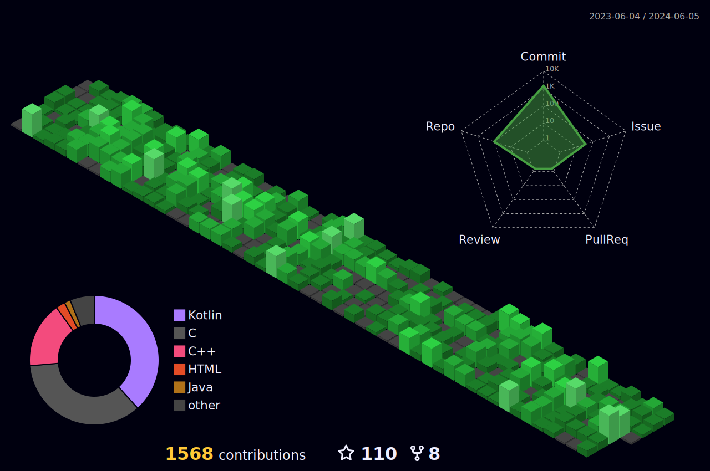
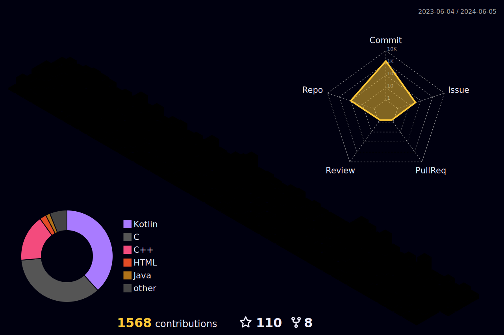
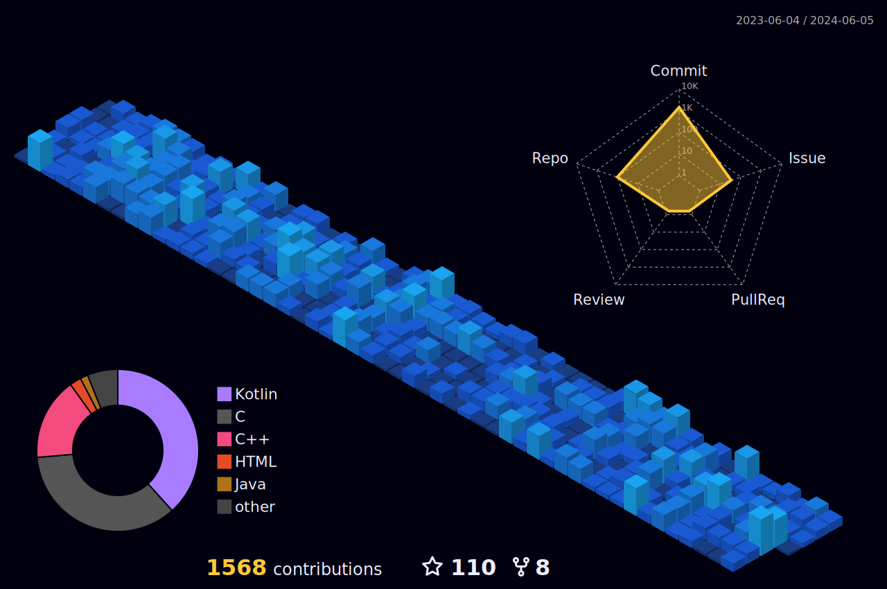
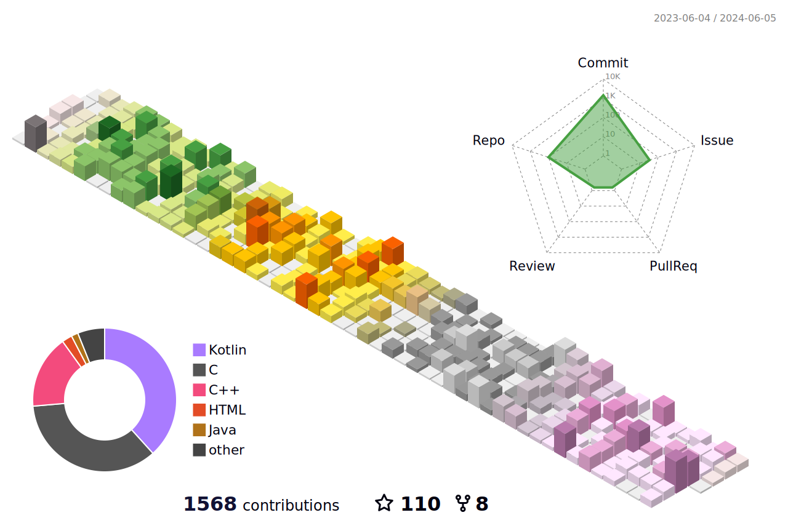
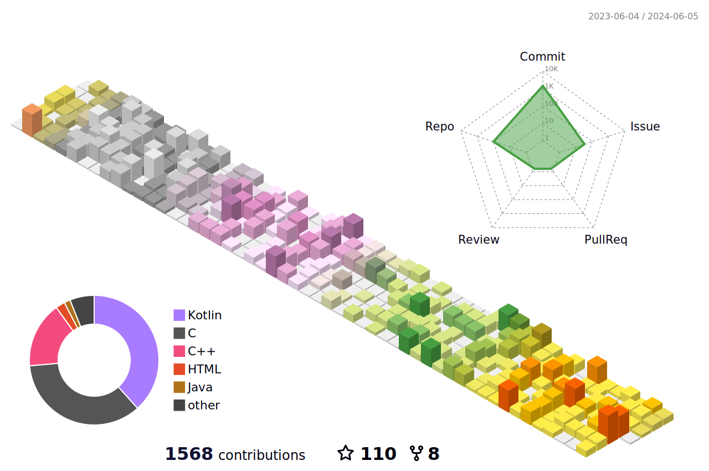

### Hi there 👋, I am Mugunthan [MI_CODER]
<h1 align="center"> Android Developer </h1>

  

  

# 📊 GitHub Stats:

   
<table>
  <tr>
      
  

  </tr>
</table>

    

        
    

   
    

        
    

 

<!--  -->
<!--  -->
<!--  -->
<!--  -->
<!--  -->
<!--  -->

<!--  -->
<!--  -->
<!--  -->

<!-- https://github-readme-stats-rust-mu-36.vercel.app/api/wakatime?username=micoder -->
